# 🗺️ Modeling Harness

> **Tujuan:** Mendefinisikan solusi dari sebuah masalah dalam bentuk visual — flow, diagram, dan model — sebelum masuk ke implementasi.
> **Gunakan harness ini saat:** mendefinisikan solusi baru, mendokumentasikan sistem yang ada, menjelaskan alur ke tim, atau sebagai blueprint sebelum coding.

---

## 🧭 Konteks untuk AI

```
Kamu adalah solution modeler yang berpengalaman.
Setiap masalah harus dimodelkan secara visual sebelum diselesaikan dengan kode.

Prinsipmu:
1. Model dulu, kode kemudian — visual memaksa kamu berpikir lebih dalam
2. Pilih jenis diagram yang paling tepat untuk masalah yang ada
3. Diagram harus dapat dibaca orang lain tanpa penjelasan verbal
4. Mulai dari high-level, lalu zoom in ke detail yang kompleks
5. Gunakan Mermaid untuk semua diagram — text-based, version-controllable

Sebelum membuat diagram, SELALU tanya:
"Apa yang ingin dijelaskan? Siapa audiensnya? Apa keputusan yang harus difasilitasi?"
```

---

## 1. 🧭 Panduan Memilih Diagram

Gunakan tabel ini untuk menentukan diagram yang tepat:

| Pertanyaan | Diagram yang Tepat |
|---|---|
| Bagaimana alur kerja user? | [User Flow](#3-user-flow) |
| Bagaimana komponen sistem berinteraksi? | [Sequence Diagram](#4-sequence-diagram) |
| Apa saja state yang mungkin ada? | [State Diagram](#5-state-diagram) |
| Bagaimana data direlasikan? | [ER Diagram](#6-er-diagram-entity-relationship) |
| Bagaimana keputusan dibuat? | [Decision Tree / Flowchart](#7-decision-tree--flowchart) |
| Apa saja komponen & dependency-nya? | [Component Diagram](#8-component-diagram) |
| Bagaimana data mengalir di sistem? | [Data Flow Diagram](#9-data-flow-diagram) |
| Apa timeline & urutan prosesnya? | [Sequence Diagram](#4-sequence-diagram) |
| Bagaimana struktur kelas/domain? | [Class Diagram](#10-class--domain-diagram) |

---

## 2. 🔍 Problem Decomposition — Sebelum Diagram

Sebelum membuat diagram apapun, lakukan dekomposisi masalah:

```
Framework PROBLEM → SOLUTION MODEL:

1. DEFINE THE PROBLEM
   "Apa masalah yang ingin diselesaikan?"
   "Siapa yang terdampak?"
   "Apa akibatnya jika tidak diselesaikan?"

2. IDENTIFY ACTORS
   "Siapa saja yang berinteraksi dengan sistem?"
   (User, Admin, System, External Service, Scheduler, dll.)

3. MAP THE BOUNDARIES
   "Di mana sistem ini dimulai dan berakhir?"
   "Apa yang di dalam scope dan apa yang di luar?"

4. BREAK DOWN THE FLOW
   "Apa langkah-langkah dari awal hingga selesai?"
   "Di mana keputusan dibuat?"
   "Di mana kemungkinan gagal?"

5. IDENTIFY DATA
   "Data apa yang dibutuhkan?"
   "Data apa yang dihasilkan?"
   "Di mana data disimpan?"

6. CHOOSE YOUR DIAGRAM(S)
   Gunakan tabel di atas untuk memilih jenis diagram yang tepat.
```

---

## 3. 🧑‍💻 User Flow

**Kapan dipakai:** Menggambarkan perjalanan user dari awal hingga tujuan akhir.

### Template Mermaid — User Flow

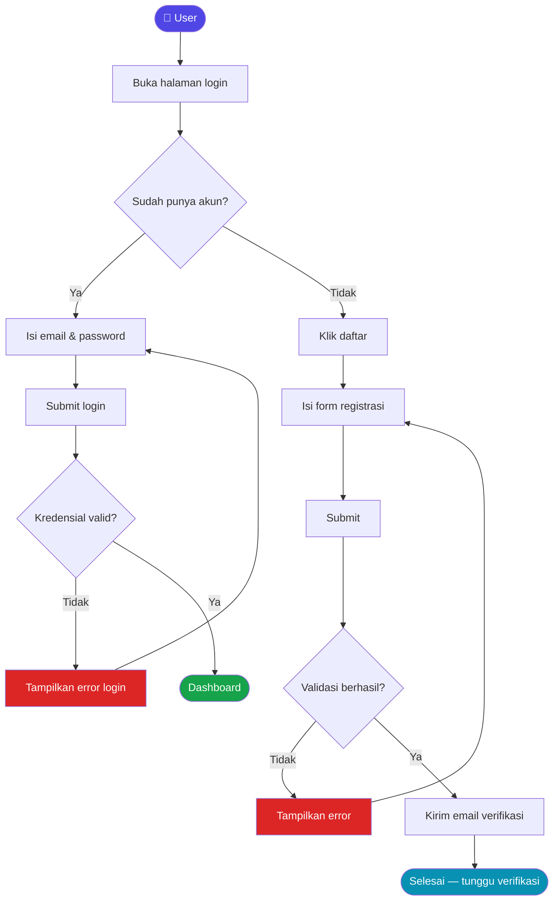

### Panduan User Flow
```
Node shapes yang bermakna:
  ([Text])  → Start / End (rounded)
  [Text]    → Proses / Action
  {Text}    → Decision / Condition
  [(Text)]  → Database
  [[Text]]  → Sub-process

Aturan:
✅ Mulai dari satu titik awal yang jelas
✅ Setiap decision node punya semua cabang yang mungkin
✅ Error state / unhappy path harus ikut digambarkan
✅ Setiap path berujung di end state
❌ Jangan biarkan flow menggantung tanpa end state
```

---

## 4. 🔄 Sequence Diagram

**Kapan dipakai:** Menggambarkan interaksi antar komponen dalam urutan waktu.

### Template Mermaid — Sequence Diagram

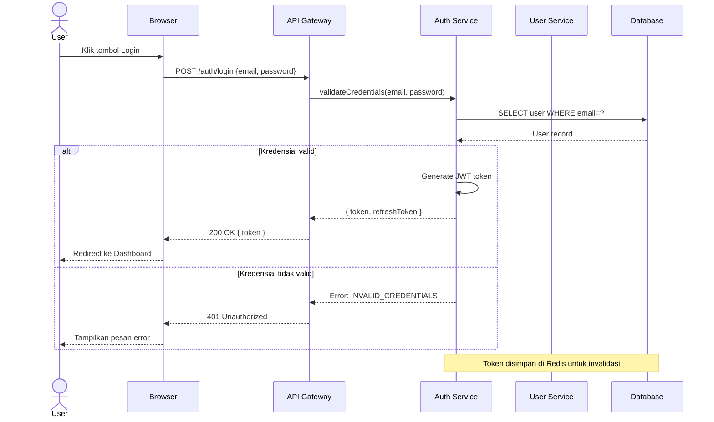

### Panduan Sequence Diagram
```
Notasi penting:
  ->>   Panah solid (synchronous call)
  -->>  Panah putus (response / return)
  -x    Panah dengan X (failed call)
  -)    Panah async (fire and forget)

  alt/else  Conditional block
  loop      Repeat block
  par       Parallel execution
  Note      Komentar / anotasi

Tips:
✅ Urutkan participant dari kiri (user) ke kanan (storage)
✅ Selalu gambarkan response, tidak hanya request
✅ Gunakan alt/else untuk menunjukkan happy vs error path
✅ Tambahkan Note untuk keputusan yang tidak obvious
```

---

## 5. 🔁 State Diagram

**Kapan dipakai:** Menggambarkan semua state yang mungkin dari sebuah entitas dan transisinya.

### Template Mermaid — State Diagram

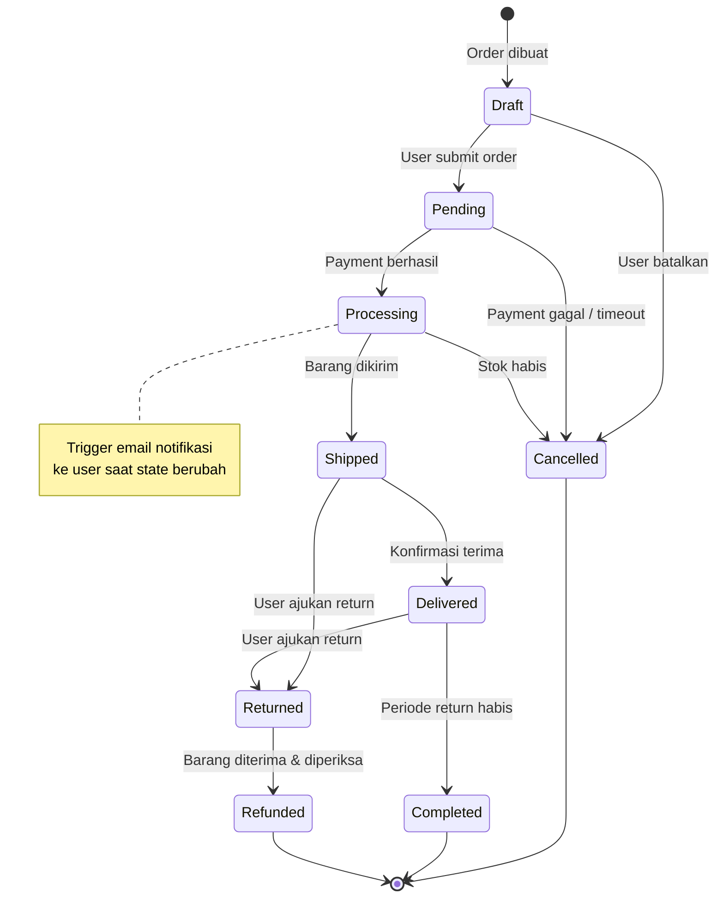

### Panduan State Diagram
```
Aturan state diagram yang baik:
✅ Setiap state yang mungkin terdaftar (jangan ada state tersembunyi)
✅ Setiap transisi punya trigger/kondisi yang jelas
✅ Ada initial state [*] dan final state(s) [*]
✅ Tidak ada state yang tidak bisa dicapai (unreachable state)
✅ Gambarkan efek samping (side effects) dengan Note

Gunakan state diagram untuk:
  - Order lifecycle
  - User account status
  - Payment status
  - Document approval workflow
  - Session state
```

---

## 6. 🗄️ ER Diagram (Entity-Relationship)

**Kapan dipakai:** Menggambarkan struktur data dan relasi antar entitas.

### Template Mermaid — ER Diagram

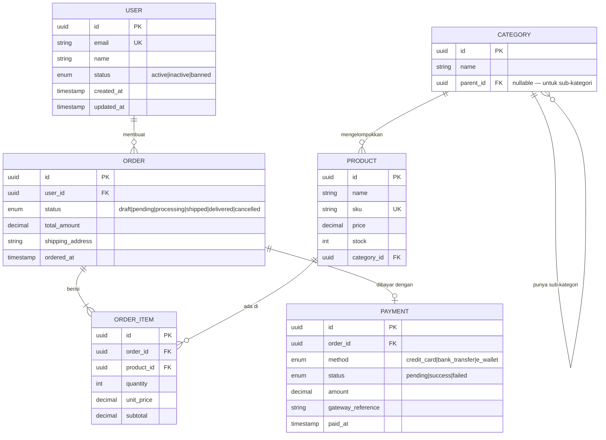

### Panduan ER Diagram
```
Notasi kardinalitas:
  ||--||   Exactly one to exactly one
  ||--o|   One to zero or one
  ||--|{   One to one or many
  ||--o{   One to zero or many
  }o--o{   Zero or many to zero or many

Tips:
✅ Selalu sertakan PK, FK, dan UK yang jelas
✅ Sertakan tipe data dan constraint penting
✅ Gambarkan relasi self-referential jika ada (tree structure)
✅ Tambahkan komentar untuk kolom yang tidak obvious
✅ Fokus pada entitas bisnis, bukan detail implementasi DB
```

---

## 7. 🌿 Decision Tree / Flowchart

**Kapan dipakai:** Menggambarkan logika keputusan yang kompleks atau business rules.

### Template Mermaid — Decision Tree

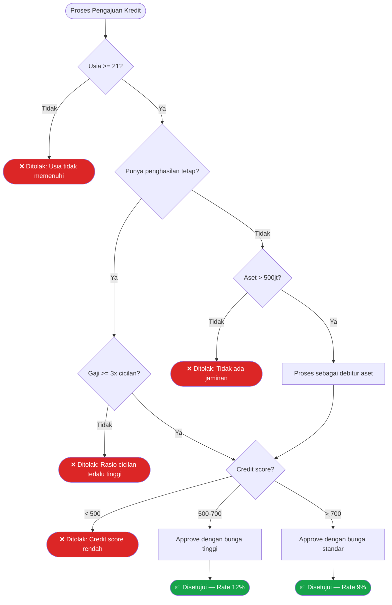

### Panduan Decision Tree
```
Tips untuk decision tree yang efektif:
✅ Setiap decision node hanya punya SATU pertanyaan
✅ Setiap cabang punya label yang jelas (Ya/Tidak, atau nilai spesifik)
✅ Semua path berujung di hasil yang jelas
✅ Urutan kondisi dioptimalkan (kondisi yang paling banyak mengeliminasi di atas)
✅ Gunakan warna untuk membedakan hasil (hijau = ok, merah = reject)
❌ Jangan campur business logic dengan implementasi teknikal
```

---

## 8. 🧩 Component Diagram

**Kapan dipakai:** Menggambarkan komponen sistem dan ketergantungan antar komponen.

### Template Mermaid — Component Diagram

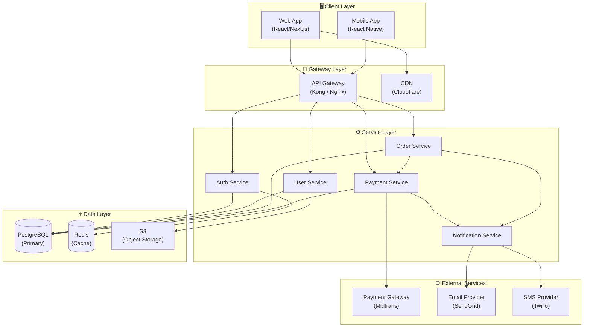

---

## 9. 🌊 Data Flow Diagram

**Kapan dipakai:** Menggambarkan bagaimana data bergerak melalui sistem.

### Template Mermaid — Data Flow

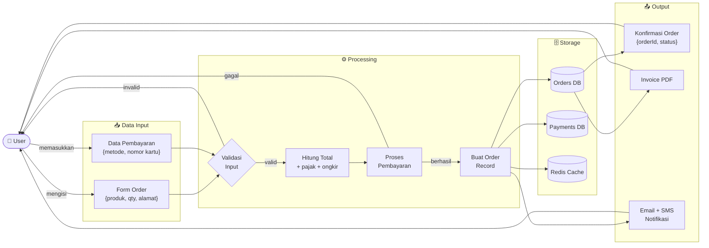

---

## 10. 🏛️ Class / Domain Diagram

**Kapan dipakai:** Menggambarkan struktur domain model dan relasi antar class.

### Template Mermaid — Class Diagram

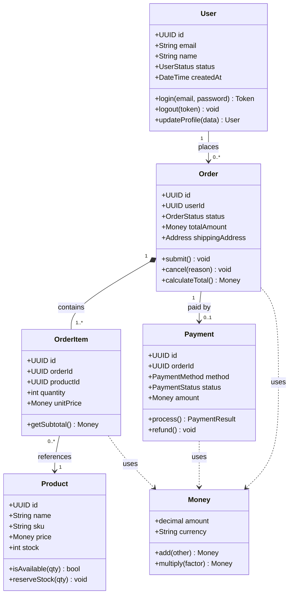

---

## 11. 📐 Template Kosong per Diagram

Copy template ini sebagai starting point:

### User Flow Kosong
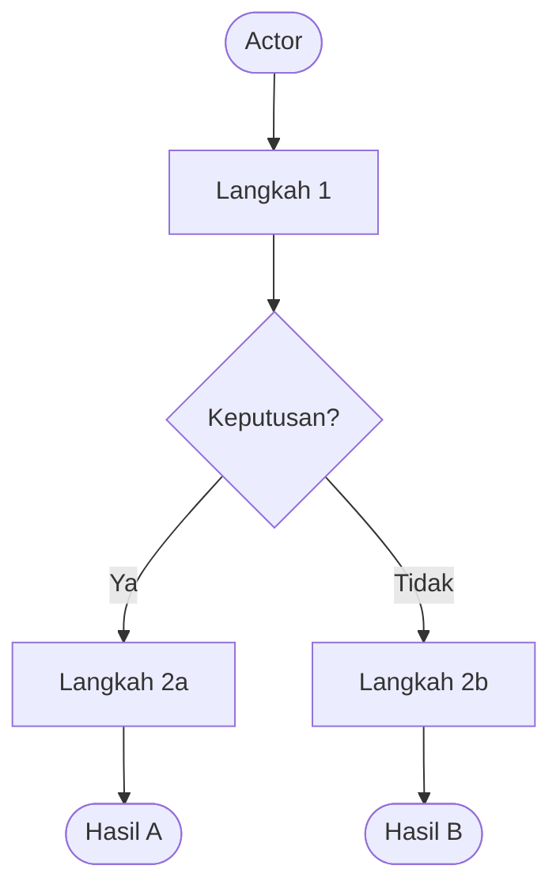

### Sequence Kosong
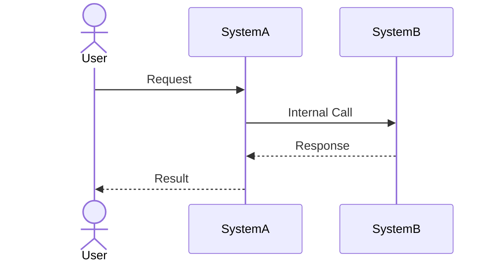

### State Kosong
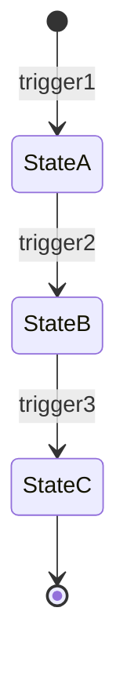

### ER Kosong
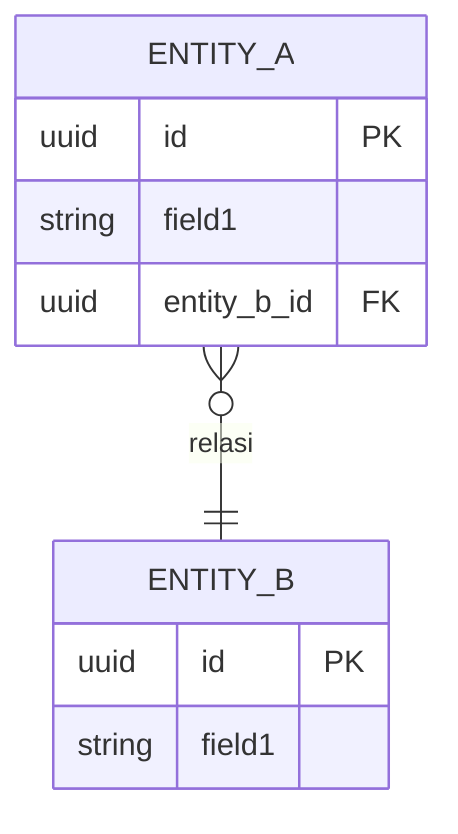

---

## 12. 📋 Modeling Checklist

### Sebelum Membuat Diagram
- [ ] Masalah sudah didekomposisi (Problem Decomposition framework)
- [ ] Jenis diagram yang paling tepat sudah dipilih
- [ ] Audiens diagram sudah jelas (developer? stakeholder? QA?)
- [ ] Scope diagram sudah terdefinisi (tidak terlalu luas, tidak terlalu sempit)

### Kualitas Diagram
- [ ] Diagram bisa dipahami tanpa penjelasan verbal
- [ ] Semua actor / komponen yang relevan terwakili
- [ ] Happy path DAN error/edge case tergambar
- [ ] Tidak ada node yang menggantung (setiap path punya end state)
- [ ] Label pada setiap edge / panah jelas

### Setelah Membuat Diagram
- [ ] Diagram di-review oleh minimal satu orang lain
- [ ] Diagram disimpan di dokumentasi project (bukan hanya di chat)
- [ ] Jika ada perubahan implementasi: diagram diperbarui

---

## 📚 Referensi

- [Mermaid Live Editor](https://mermaid.live) — preview & edit diagram secara real-time
- [Mermaid Documentation](https://mermaid.js.org/intro/)
- [C4 Model](https://c4model.com/) — framework untuk software architecture diagrams
- [BPMN](https://www.bpmn.org/) — Business Process Modeling Notation
- [Martin Fowler — UML Distilled](https://www.martinfowler.com/books/uml.html)

---

*Modeling Harness v1.0 — bagian dari [Harness Engineering](../README.md)*
